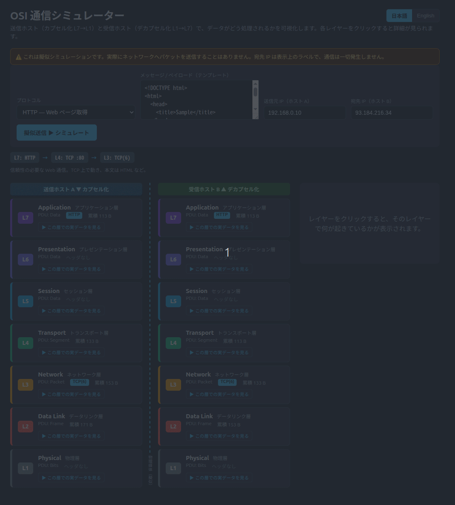

# OSI 通信シミュレーター (OSI Model Visualizer)

[](https://github.com/tkm112345/osi-visualizer/actions/workflows/ci.yml)
[](./LICENSE)

OSI 参照モデルのカプセル化／デカプセル化を可視化する Web アプリ。**送信ホスト**でデータが L7 → L1 へ**カプセル化**され、
**受信ホスト**で L1 → L7 へ**デカプセル化**される様子を、レイヤーごとのヘッダ・PDU・実データまで含めて可視化する。
各レイヤーをクリックすると、付与／除去されるヘッダや処理内容が確認できる。

> ⚠️ **これは擬似シミュレーションです。** 実際にネットワークへパケットを送信することは一切ありません。
> 宛先 IP は表示上のラベルで、ソケットも開かず通信は発生しません。ローカルの Go サーバが各レイヤーの処理内容を計算して返すだけです。

## デモ / Demo



> HTTPS を選んで擬似送信し、カプセル化 → デカプセル化、各層の実データ表示、日本語 / English 切り替えまでを収録。
> GIF の差し替え手順は [docs/RECORDING.md](./docs/RECORDING.md) を参照。

- **フロントエンド**: React + Vite + TypeScript
- **バックエンド**: Go（標準ライブラリのみ）
- **言語**: UI と解説文を **日本語 / English** で切り替え可能（右上のスイッチ）

## 特徴

- **18 種類のプロトコルを選択でき**、選択に応じてスタック構成とペイロードが変わる:
  - Web: `HTTP` / `HTTPS` / `WebSocket`（HTTP/HTTPS のペイロードは **HTML テンプレート**、HTTPS は L6 で TLS）
  - ファイル/メール/リモート: `FTP` / `SMTP` / `SSH`
  - IoT/メッセージング: `MQTT` / `CoAP`
  - メディア: `RTSP` / `RTP`、インフラ: `DNS` / `DHCP` / `NTP` / `SNMP`、診断: `Ping`
  - **シリアル通信（L1-L2 のみ・IP なし）**: `UART` / `I2C` / `SPI`
- 選択で L4 が **TCP↔UDP** に変化。`Ping` は **L4・L7 を使わず** L3 に **ICMP**（`[IP [ICMP [Data]]]`）。
  `UART`/`I2C`/`SPI` は **L3〜L7 を使わず** L1/L2 だけでフレーム化・信号化する。
- 送信ホスト A（L7→L1）と受信ホスト B（L1→L7）を左右に並べ、送信→受信を連続アニメーション（途中で **停止** も可能）。
- 起動直後から両ホストのレイヤースタックを表示。
- L1〜L7 を積み上げ表示。カプセル化でヘッダが増え、デカプセル化で外れていく様子が見える。
- **L5（セッション）/ L6（プレゼンテーション）も表示**。これらは独立ヘッダを付けず「処理内容」を明示することで、
  OSI（理論）と TCP/IP（実装）のギャップまで可視化する。
- 受信側は宛先 MAC/IP の確認・ポートによるアプリ振り分けなど、**受信ホスト特有の処理**も表示。
- 各レイヤーのヘッダ・PDU・累積バイト数・構造 `[Eth [IP [TCP [Data]]]]` を表示。
- 各レイヤーで **「この層での実データ」をアコーディオン表示**。ヘッダ/ペイロード/トレーラの区画ごとに
  テンプレート由来の実データを見せる（HTTPS は L6 で暗号文→平文に変わる様子まで）。
- **日本語 / 英語の即時切り替え**。解説文もバックエンドが両言語を返すため、再読み込みなしで切り替わる。

### カプセル化のイメージ

```
L7 Application  Data     +0   →  5B   [Data]
L6 Presentation Data     +0   →  5B   [Data]          ← ヘッダなし（処理のみ）
L5 Session      Data     +0   →  5B   [Data]          ← ヘッダなし（処理のみ）
L4 Transport    Segment +20   → 25B   [TCP [Data]]
L3 Network      Packet  +20   → 45B   [IP [TCP [Data]]]
L2 Data Link    Frame   +18   → 63B   [Eth [IP [TCP [Data]]] FCS]
L1 Physical     Bits     +0   → 63B   (ビット列に変換)
```

## 必要環境

- Go 1.24+ / Node.js 20+ / npm（ローカル開発）
- もしくは Docker + Docker Compose（推奨・下記）

## 起動方法（Docker・推奨）

一発で起動する。フロント(nginx)が静的ファイルを配信し、`/api` をバックエンドコンテナへプロキシする。

```bash
docker compose up --build
```

ブラウザで <http://localhost:8080> を開く。停止は `docker compose down`。

構成:

```
[ブラウザ] → :8080 frontend(nginx) ──/api──▶ backend(Go:8080)
                     └─ 静的ファイル(dist)配信
```

- `backend/Dockerfile` … マルチステージビルド（`golang:1.24` → `distroless/static` の最小イメージ）
- `frontend/Dockerfile` … `node:20` でビルド → `nginx` で配信（`nginx.conf` が `/api` をプロキシ）
- `docker-compose.yml` … 2 サービスを起動。backend は外部公開せず frontend 経由でのみアクセス

## 起動方法（ローカル開発）

ターミナルを 2 つ使う。フロントの Vite dev サーバが `/api` を `:8080` にプロキシする。

### 1. バックエンド (:8080)
```bash
cd backend
go run .
```

### 2. フロントエンド (:5173)
```bash
cd frontend
npm install   # 初回のみ
npm run dev
```

ブラウザで <http://localhost:5173> を開き、「送信」を押す。各レイヤーをクリックすると詳細が表示される。

## テスト

```bash
cd backend && go test ./...
```

## API

| メソッド | パス | 説明 |
|---------|------|------|
| GET  | `/api/layers` | 全 7 層の静的メタ情報 |
| GET  | `/api/protocols` | 選択可能な 18 プロトコルの一覧（Web / IoT / メディア / インフラ / 診断 / シリアル） |
| POST | `/api/encapsulate` | `{message, srcIp, dstIp, protocol}` を受け取り送信側 L7→L1 の各ステップを返す |
| POST | `/api/decapsulate` | 同じ入力から受信側 L1→L7 の各ステップ（擬似）を返す |

解説文・ラベルは各フィールドに `{ "ja": ..., "en": ... }` の両言語を含めて返すため、
フロントエンドは再取得なしで言語を切り替えられる。

## プロジェクト構成

```
osi-visualizer/
├── docker-compose.yml # backend + frontend(nginx) を起動
├── docs/RECORDING.md  # デモ GIF の作り方
├── backend/           # Go（標準ライブラリのみ）
│   ├── Dockerfile     # multi-stage → distroless
│   ├── main.go        # HTTP サーバ・CORS・4 エンドポイント
│   └── osi/           # レイヤー定義・カプセル化ロジック・多言語(text.go)（+ テスト）
└── frontend/          # React + Vite + TypeScript
    ├── Dockerfile     # build → nginx
    ├── nginx.conf     # /api をバックエンドへプロキシ
    └── src/
        ├── App.tsx
        ├── i18n.ts     # 言語切り替え（UI 文言 + Text ピッカー）
        └── components/ # LayerStack / LayerCard / FrameView / PacketDetail
```

## コントリビュート

歓迎します。[CONTRIBUTING.md](./CONTRIBUTING.md) と [行動規範](./CODE_OF_CONDUCT.md) を参照してください。

## ライセンス

[MIT](./LICENSE)
